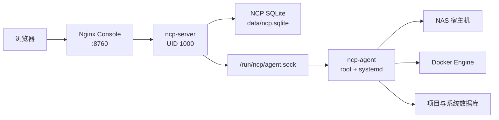

# NAS Control Plane

> 当前开发快照：2026-07-29。NCP 已形成 Root Agent、NCP Server 与 Vue 控制台的完整管理链路；OpenSpec 默认禁用，后续按轻量 SDD 维护。

## 当前可用能力

- 实时总览与历史监控：CPU、内存、负载、存储、网络和 Docker 状态通过 SSE 更新，支持快捷范围与精确起止时间。
- 站点中心：仅收录经过 Web 探测的入口，支持手动站点、Favicon、图标上传、收藏、隐藏、排序和忽略恢复。
- Docker：项目、容器、本地镜像、Docker Hub 搜索、标签选择、可取消与重试的持久化镜像拉取任务、Compose 校验/草稿/部署和版本记录。
- 数据库：自动发现 SQLite、MySQL/MariaDB、PostgreSQL，支持表结构、表数据 CRUD 与 SQL 工作台。
- 日志中心：系统、Agent 和容器日志查询，真实时间范围、纳秒级原始时间、语义高亮与增量 SSE 跟随。
- 终端：宿主机 Root PTY 和容器 Shell，支持 Tab、历史、窗口自适应、浅色 ANSI 配色和带能力回报的 ble.sh 高亮。
- 设置与用户：设置自动保存到 SQLite，字号/密度/字体真实生效；多账号均为等权 Root，支持账号和密码管理。

所有管理页面默认使用中文；Docker、Compose、SQL、SSE 等固定专业术语保留原名。

NAS Control Plane（NCP）是面向绿联 NAS 的本地服务器管理面板。项目参考服务器控制面板的管理思路，通过浏览器统一查看 NAS 实时状态、访问局域网服务、管理 Docker 与数据库，并逐步接入监控、日志和终端等能力。

NCP 采用“非特权 Web 服务 + 原生 Root Agent”的双进程架构。浏览器只访问 `ncp-server`；需要宿主机权限的 Docker、系统指标、数据库发现等操作，由以 root 身份运行的 `ncp-agent` 通过 Unix Socket 提供。

> 当前项目处于持续开发阶段。已上线的功能使用真实 NAS 数据，不使用模拟在线状态；尚未完成的模块会明确标记为待接入。

## 功能概览

| 模块 | 当前能力 |
| --- | --- |
| 总览 | NAS、CPU、内存、存储、网络和 Docker 实时状态；趋势图表与实时事件更新 |
| 服务入口 | 按 Compose 项目归类服务，展示运行状态和公开端口，提供统一访问入口 |
| Docker 管理 | 项目、容器、端口、工作目录和运行状态；容器启动、停止、重启与日志查看 |
| 数据库 | 自动发现项目与 NAS 系统数据库；数据库、数据表和表工作台三级导航 |
| 数据表 | 表数据分页、排序、新增、编辑、删除；表信息、字段结构和 SQL 定义 |
| SQL 工作台 | 执行 SQL，展示结果、影响行数、耗时和错误信息 |
| 系统信息 | 主机、Root Agent、Docker Engine 和能力接入状态 |
| 登录 | 首次初始化 Root 管理账号，后续使用登录会话访问控制面 |

当前数据库重点支持：

- SQLite
- MySQL / MariaDB
- PostgreSQL

数据库发现会分析项目目录、Docker Compose 元数据、容器挂载、数据库容器以及项目中的 JDBC / `DATABASE_URL` 配置，并尽可能关联所属项目与功能模块。Redis / Valkey 等当前未使用的数据库类型暂未接入。

## 系统架构



职责边界：

- `ncp-agent`：以 root 身份运行，负责宿主机指标、Docker、systemd、journald、数据库发现和后续终端能力。
- `ncp-server`：以普通用户运行，负责 HTTP API、登录会话、NCP 元数据和 Agent RPC 转发。
- `ncp-console`：Nginx 托管 Vue SPA，并将 `/api/` 代理到 `ncp-server`。
- 浏览器不会直接连接 Root Agent。

## 技术栈

### 后端

- Go 1.26
- Chi
- gRPC over Unix Socket
- Docker Moby Client
- SQLite / MySQL / PostgreSQL 驱动
- gopsutil

### 前端

- Vue 3
- TypeScript
- Vite
- Pinia
- Vue Router
- Element Plus
- ECharts
- CodeMirror

### 部署

- systemd：运行原生 Root Agent
- Docker Compose：运行 NCP Server 和 Nginx Console
- Linux ARM64：绿联 NAS 目标架构

## 项目结构

```text
.
├── api/                         # OpenAPI 与 RPC 契约
├── cmd/
│   ├── ncp-agent/              # Root Agent 入口
│   └── ncp-server/             # HTTP Server 入口
├── internal/
│   ├── agentsocket/            # Unix Socket gRPC 服务与客户端
│   ├── auth/                   # Root 登录和会话
│   ├── database/               # 数据库发现、查询和 CRUD
│   ├── docker/                 # Docker 读取与控制
│   ├── httpapi/                # HTTP API
│   ├── journal/                # journald 能力
│   ├── system/                 # 主机能力与实时指标
│   └── terminal/               # 终端能力
├── frontend/                   # Vue 3 管理控制台
├── deploy/
│   ├── console/                # Compose、Nginx 和 Server 镜像
│   └── systemd/                # Root Agent systemd 单元
├── docs/                       # 规格、架构决策与阶段进度
└── openspec/                   # 保留的 OpenSpec 规格记录
```

## 环境要求

开发环境：

- Go 1.26 或更高版本
- Node.js 24 或更高版本
- pnpm 11

NAS 部署环境：

- Linux ARM64
- systemd
- Docker Engine
- Docker Compose
- 具备 sudo 权限的管理账号

以下命令假设仓库位于：

```text
/volume2/Project/nas-control-plane
```

如果实际路径不同，请替换命令中的项目路径。

## 开发与构建

### 后端验证

```bash
go test ./...
go vet ./...
go build -buildvcs=false ./cmd/ncp-agent
go build -buildvcs=false ./cmd/ncp-server
```

### 前端开发

```bash
cd frontend
pnpm install --frozen-lockfile
pnpm run dev
```

### 前端生产构建

```bash
cd frontend
pnpm run build
```

`pnpm run build` 会先执行 Vue TypeScript 类型检查，再生成 `frontend/dist/`。

### Linux ARM64 交叉编译

Linux / NAS：

```bash
make build-linux-arm64
```

Windows PowerShell：

```powershell
$env:GOOS = 'linux'
$env:GOARCH = 'arm64'
$env:CGO_ENABLED = '0'

go build -buildvcs=false -trimpath -o bin/ncp-agent-linux-arm64 ./cmd/ncp-agent
go build -buildvcs=false -trimpath -o bin/ncp-server-linux-arm64 ./cmd/ncp-server
```

## 首次部署

### 1. 构建前端与 ARM64 二进制

```bash
cd /volume2/Project/nas-control-plane

cd frontend
pnpm install --frozen-lockfile
pnpm run build
cd ..

make build-linux-arm64
```

### 2. 安装 Root Agent 与终端高亮

推荐使用仓库内的幂等安装脚本。它会同步安装 Agent、systemd 单元、NCP 专用 Bash 配置，并从 ble.sh 官方固定版本 `v0.4.0-devel3` 安装交互式命令高亮；不会修改 `/root/.bashrc`。

```bash
sudo sh deploy/systemd/install-agent.sh \
  /volume2/Project/nas-control-plane \
  /volume2/Project/nas-control-plane/bin/ncp-agent-linux-arm64
```

Agent 启动后应创建：

```text
/run/ncp/agent.sock
```

检查 Socket：

```bash
stat -c '%A %U %G %n' /run/ncp /run/ncp/agent.sock
```

预期目录属于 `root:users`，Socket 权限为 `srw-rw----`。

### 3. 设置 Server 镜像版本

镜像标签遵循：

```text
YYYY.M.D-vN
```

例如：

```text
nas-control-plane:2026.7.23-v6
```

修改 `deploy/console/docker-compose.yml` 中 Server 的 `image`，确保它与本次构建标签一致。

### 4. 构建 Server 镜像

能够正常下载 Go 依赖时：

```bash
cd /volume2/Project/nas-control-plane/deploy/console
docker compose build server
```

NAS 构建网络不可用时，可使用预编译 ARM64 二进制：

```bash
cd /volume2/Project/nas-control-plane

docker build \
  -f deploy/console/Dockerfile.server.prebuilt \
  -t nas-control-plane:2026.7.23-v6 \
  .
```

> `bin/ncp-server-linux-arm64` 是离线镜像构建所需的默认文件名。请将示例标签替换为当前发布标签。

### 5. 启动 Compose 项目

必须先启动 Root Agent，再启动 Compose。这样 Server 才能绑定已经存在的 `/run/ncp`。

```bash
cd /volume2/Project/nas-control-plane/deploy/console
docker compose up -d
docker compose ps
```

安装脚本会同时安装并启用 `ncp-stack.service`，用于开机阶段的一次性恢复。该单元在
`local-fs.target`、Docker Engine 与 `ncp-agent.service` 之后运行，最多等待 15 次、每次 2 秒；
就绪后执行一次 `docker compose up -d`，随后结束并保持完成状态。

运行时约定如下：

- `ncp-agent.service` 使用 `Restart=on-failure`，异常退出后由 systemd 自动重启。
- Compose 服务使用 `restart: unless-stopped`，Docker 重启后按 Docker 的重启策略恢复。
- `ncp-stack.service` 只在开机阶段执行一次，不创建 `ncp-stack-reconcile.service`，不创建定时器，
  也不运行两分钟一次或其他持续轮询任务。
- 需要手动恢复时执行 `sudo systemctl start ncp-stack.service`，然后用
  `systemctl status ncp-stack.service` 与 `docker compose ps` 查看结果。

Compose 项目名称固定为：

```text
nas-control-plane
```

使用支持 Compose 项目识别的绿联 Docker 管理界面时，该项目会以 `nas-control-plane` 显示。

控制台默认地址：

```text
http://<NAS_IP>:8760
```

首次打开时，页面会引导初始化 Root 管理账号。账号凭据不会写入仓库或 README。

## 日常升级

推荐顺序：

```bash
cd /volume2/Project/nas-control-plane

# 1. 更新源码后重新构建
cd frontend
pnpm run build
cd ..
make build-linux-arm64

# 2. 备份并更新 Agent、终端 rcfile 与 ble.sh
sudo cp -a \
  /etc/systemd/system/ncp-agent.service \
  /etc/systemd/system/ncp-agent.service.bak

sudo sh deploy/systemd/install-agent.sh \
  /volume2/Project/nas-control-plane \
  /volume2/Project/nas-control-plane/bin/ncp-agent-linux-arm64

# 3. 构建新版本 Server 镜像
cd deploy/console
docker compose build server

# 4. 重新创建 Server，Console 和数据目录保持不变
docker compose up -d --force-recreate server
docker compose ps
```

`frontend/dist/` 通过只读目录挂载到 Console，更新构建产物后通常不需要重建 Nginx 容器。

### Root Agent 重启与 Socket 目录

`ncp-agent.service` 必须使用：

```ini
RuntimeDirectoryPreserve=yes
```

Server 容器绑定的是 `/run/ncp` 目录。如果旧版 systemd 单元在 Agent 重启时删除并重新创建该目录，Server 会继续挂载失效的旧目录，看不到新的 `agent.sock`。表现为：

- `/api/v1/system/summary` 返回 `503`
- `/api/v1/databases/discovery` 失败
- 宿主机能看到 Socket，但 Server 容器内看不到

从旧版单元升级后，请执行一次：

```bash
cd /volume2/Project/nas-control-plane/deploy/console
docker compose up -d --force-recreate server
```

此后 `RuntimeDirectoryPreserve=yes` 会在 Agent 重启时保留目录 inode，避免再次失联。

## 部署验证

### Agent 与 Socket

```bash
systemctl --no-pager --full status ncp-agent.service
stat -c '%A %U %G %n' /run/ncp /run/ncp/agent.sock
```

### Compose

```bash
cd /volume2/Project/nas-control-plane/deploy/console
docker compose ps
docker inspect --format \
  '{{.Config.Image}} {{.State.Status}} {{if .State.Health}}{{.State.Health.Status}}{{end}}' \
  nas-control-plane
```

### Console

```bash
curl -fsS http://127.0.0.1:8760/healthz
```

预期返回：

```text
ok
```

未登录访问受保护 API 返回 `401` 属于正常行为。登录后应重点验证：

- `/api/v1/system/summary`
- `/api/v1/docker/inventory`
- `/api/v1/databases/discovery`

## 故障排查

### Agent 正常，但所有实时 API 返回 503

分别检查宿主机与 Server 容器：

```bash
ls -l /run/ncp/agent.sock
docker exec nas-control-plane ls -l /run/ncp/agent.sock
```

如果宿主机存在、容器内不存在，说明容器仍绑定旧目录。确认新版 systemd 单元已安装后，重新创建 Server：

```bash
cd /volume2/Project/nas-control-plane/deploy/console
docker compose up -d --force-recreate server
```

### 数据库发现失败

先确认系统概览和 Docker Inventory 是否正常。如果它们也失败，优先排查 Agent Socket，而不是数据库凭据。

```bash
systemctl status ncp-agent.service
docker logs --tail 100 nas-control-plane
```

如果只有某个需要登录的 MySQL / PostgreSQL 来源失败，再检查该数据库连接信息。

### Server 镜像构建卡在 `go mod download`

使用已验证的 ARM64 二进制和离线 Dockerfile：

```bash
cd /volume2/Project/nas-control-plane
make build-linux-arm64

docker build \
  -f deploy/console/Dockerfile.server.prebuilt \
  -t nas-control-plane:YYYY.M.D-vN \
  .
```

### 查看运行日志

```bash
journalctl -u ncp-agent.service --no-pager -n 100
docker logs --tail 100 nas-control-plane
docker logs --tail 100 nas-control-plane-console
```

## API 与规格

- OpenAPI：[`api/openapi/`](api/openapi/)
- RPC 契约：[`api/proto/`](api/proto/)
- 架构决策：[`docs/adr/`](docs/adr/)
- 功能规格：[`docs/specs/`](docs/specs/)
- 阶段进度：[`docs/PROGRESS.md`](docs/PROGRESS.md)

OpenSpec 在本项目中按需使用：明确的局部功能和 Bug 修复直接实现；重大架构调整、跨模块协议、数据迁移或需要长期保留的设计决策再维护完整规格。

## 版本与提交规范

镜像版本：

```text
YYYY.M.D-vN
```

Git 提交使用 Conventional Commits，类型使用英文，说明使用中文：

```text
feat(database)：实现数据库自动发现
fix(agent)：修复Socket目录生命周期
fix(web)：统一工作区标题栏控件
build(deploy)：发布2026.7.23-v6
docs(readme)：完善部署与故障排查说明
```

每个提交只包含一个可独立说明和验证的功能模块。
